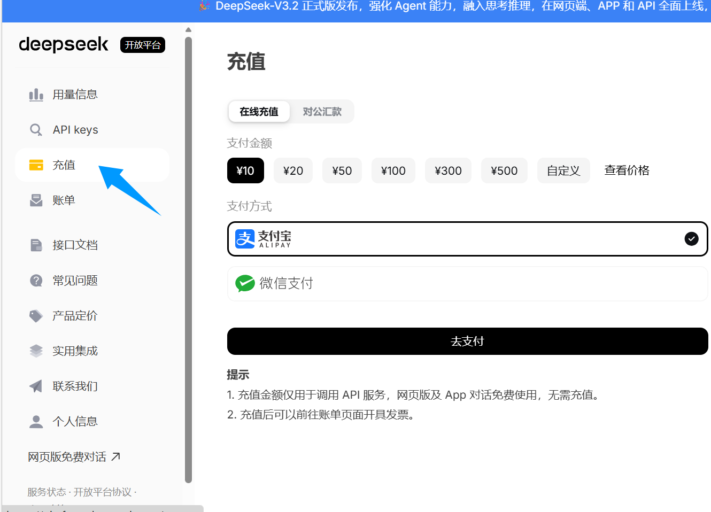
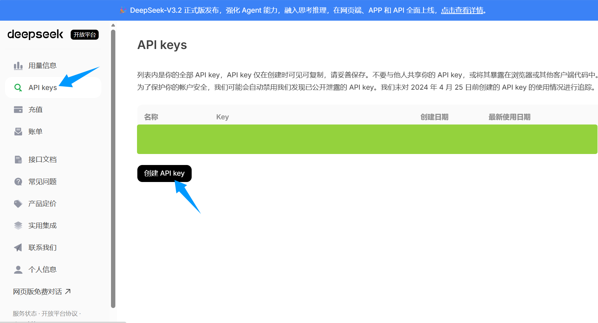

# RainClassroomAssitantImprove
- 原 **开源项目**: [RainClassroomAssitant](https://github.com/TrickyDeath/RainClassroomAssitant.git)
- 在此基础上我进行了如下 **优化**:
  - 优化了 **多线程轮询逻辑**，下课或无课时从固定等待 30 秒改为可以在 **配置** 页面修改，并在状态栏实时显示活动状态，默认 3 秒
  - 添加了 **签到延迟**，防止一上课就签到，同样可在 **配置** 页面修改，默认延迟 15 秒
  - 信息面板添加了 **题目查看** 的调试输出，因为返回的 problem 的 answers 其实是空的，所以只能自己答
  - 添加了 **题目延时处理**，如果题目是延时的，应该尝试 重新答题
  - 添加了 **接入LLM来答题** 的功能，把题目数据 dump 成 json 文件，然后送给 LLM 处理，只需在 **配置** 页面填上 **API key**，并进行 **接口测试**，成功后即可使用。目前只做答 **选择题**，其它题型会提示到 雨课堂 自己做。如果想要答题无关正确率随机做答，可以在 **配置** 页面勾选 **自动答题**，然后勾选 **随机做答**。
  - 扩展了 **主流 LLM** 支持，内置 **DeepSeek、OpenAI、Gemini、智谱、Kimi、通义千问、OpenRouter**，并支持 **自定义 OpenAI 兼容接口**，可手动填写 `model` 和 `Base URL`
  - **登录界面** 放在 **主窗口** 右边，能更清晰地看到 **登录状态**，**API 测试状态**
- **接入教程**：
  
  > 目前支持：**DeepSeek、OpenAI、Gemini、智谱、Kimi、通义千问、OpenRouter、自定义 OpenAI 兼容接口**
  - 这里以 DeepSeek 的 api 为例:
    - 首先去到：[DeepSeek Platform](platform.deepseek.com)
    - 然后 **充值余额**：
      - 
    - 创建 **API key**
      - 
    - 最后在 **配置页面** 填上即可
  - 其他 api 也是同理去到官网处理
  - 如果你的平台是 **OpenAI 兼容接口**，可以直接在配置页里填写：
    - **供应商**：选择对应平台或 `自定义(OpenAI兼容)`
    - **API Key**
    - **模型名**
    - **Base URL**
    - 点击 **测试**，通过后即可用于自动答题

- **WSL 运行说明**：
  - 如果你在 **WSL2 + Miniconda** 中运行，建议把 Qt 相关依赖安装到 `rainclassroom` 环境：
    - `conda install -y -n rainclassroom -c conda-forge libxcb xcb-util xcb-util-wm xcb-util-image xcb-util-keysyms xcb-util-renderutil xcb-util-cursor libxkbcommon xkeyboard-config`
  - 项目现在会在 **WSLg** 环境下自动补齐 Qt 所需的 `LD_LIBRARY_PATH`、`QT_QPA_PLATFORM=wayland`、`XDG_RUNTIME_DIR`
  - Linux / WSL 下配置文件默认保存在：`~/.config/RainClassroomAssistant/config.json`
